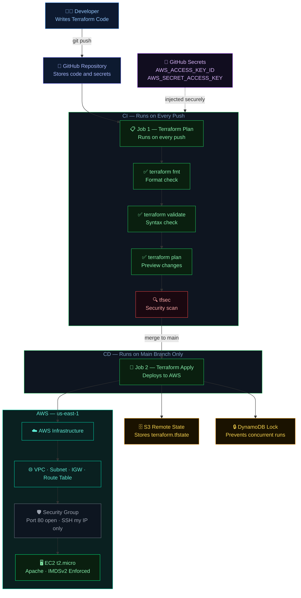

# 🔐 Secure CI/CD Pipeline
> Terraform · GitHub Actions · tfsec · Remote State · AWS


---

## What is this?

A fully automated, secure infrastructure deployment pipeline built with Terraform and GitHub Actions. Every code push triggers an automated pipeline that checks formatting, validates syntax, scans for security issues with tfsec, and deploys to AWS — all without a single manual step.

Push code. The pipeline does the rest.

---

## 🏗️ Architecture



---

## 📌 What was built

| Component | Tool | Purpose |
|---|---|---|
| ⚙️ CI/CD Pipeline | GitHub Actions | Automates plan, validate, scan and deploy |
| 🔍 Security Scanning | tfsec | Scans Terraform for misconfigurations before deploy |
| 🗄️ Remote State | S3 + DynamoDB | Stores state safely, prevents concurrent runs |
| 🔑 Secret Management | GitHub Secrets | AWS credentials never hardcoded |
| 🌐 VPC | AWS | Isolated private network |
| 📡 Public Subnet | AWS | Web tier — EC2 lives here |
| 🚪 Internet Gateway | AWS | Controlled internet access |
| 📋 Route Table | AWS | Directs traffic through IGW |
| 🛡️ Security Group | AWS | Firewall — port 80 open, SSH restricted to my IP |
| 🖥️ EC2 t2.micro | AWS | Apache web server with IMDSv2 enforced |

---

## ⚙️ How the pipeline works

### Job 1 — Terraform Plan (every push)

**terraform fmt** — enforces consistent code formatting. Messy code fails immediately.

**terraform validate** — catches syntax errors before they reach AWS.

**terraform plan** — shows exactly what will change. Nothing deployed yet — this is the review step.

**tfsec** — scans every Terraform file for security misconfigurations. Found real issues in this project and they were fixed before deployment.

### Job 2 — Terraform Apply (main branch only)

Only runs when code merges to main. Feature branches trigger plan only — no deployment. This is the GitOps workflow used in professional engineering teams.

---

## 🔍 tfsec Security Scan Results

tfsec found 9 potential problems on the first scan. Here is what was found and fixed:

| Severity | Finding | Action |
|---|---|---|
| 🔴 CRITICAL | SSH port 22 open to 0.0.0.0/0 | ✅ Fixed — restricted to my IP only |
| 🔴 CRITICAL | HTTP port 80 open to 0.0.0.0/0 | ⚠️ Intentional — public web server |
| 🔴 CRITICAL | Egress unrestricted | ⚠️ Acceptable for web server |
| 🟠 HIGH | Subnet auto-assigns public IPs | ⚠️ Intentional — public web tier |
| 🟡 MEDIUM | Missing security group descriptions | ✅ Fixed |
| 🔵 LOW | Various minor findings | ⚠️ Documented |

The SSH fix was the most important. Port 22 open to the entire internet is one of the most exploited AWS misconfigurations. tfsec caught it before deployment. That is exactly what security scanning in a pipeline is supposed to do.

---

## 🗄️ Remote State

By default Terraform stores state on your laptop — lost if your machine dies, corrupted if two runs happen at the same time.

This project uses S3 for remote state storage and DynamoDB for state locking:

```
Pipeline starts → DynamoDB locks → terraform apply runs → DynamoDB unlocks → next run can start
```

One run at a time. No conflicts. No corruption. State never lost.

---

## 🔑 Credentials — Never in code

```yaml
aws-access-key-id: ${{ secrets.AWS_ACCESS_KEY_ID }}
aws-secret-access-key: ${{ secrets.AWS_SECRET_ACCESS_KEY }}
```

Stored as GitHub Secrets. Encrypted at rest. Never visible in logs or code. Injected at runtime only.

---

## 🧱 Challenges We Solved

| Challenge | Solution |
|---|---|
| Terraform state lost on laptop | Moved to encrypted S3 remote backend |
| Two pipeline runs corrupting state | DynamoDB state locking — one run at a time |
| AWS credentials exposed in code | GitHub Secrets — injected at runtime only |
| Security misconfigurations reaching AWS | tfsec scan in pipeline — blocks bad code |
| Terraform provider too large for GitHub | Added .gitignore to exclude .terraform/ folder |
| Pipeline failing on format errors | terraform fmt -check enforces consistent formatting |
| SSH open to entire internet | tfsec caught it — restricted to trusted IP only |

---

## 💡 Why this project matters

| Skill demonstrated | How |
|---|---|
| Infrastructure as Code | Entire AWS stack in Terraform — nothing manual |
| CI/CD automation | GitHub Actions deploys on every push to main |
| Security mindset | tfsec scans every deployment — issues fixed before production |
| Secret management | AWS credentials never in code |
| Remote state | S3 + DynamoDB — production standard |
| Git workflow | Feature branches for dev, main for production |
| Cost awareness | ~$0.01/month total |

---

## 🚀 Pipeline run summary

```
git push to main
      ↓
Job 1: Terraform Plan ——— 21s
  ✅ fmt · validate · plan · tfsec
      ↓
Job 2: Terraform Apply ——— 1m 22s
  ✅ terraform apply -auto-approve
      ↓
Infrastructure live on AWS
Total time: 1m 50s
```

---

## 💰 Cost Breakdown

| Resource | Monthly Cost |
|---|---|
| EC2 t2.micro | $0.00 (free tier) |
| S3 state bucket | ~$0.01 |
| DynamoDB lock table | $0.00 (PAY_PER_REQUEST) |
| VPC / Subnet / IGW | $0.00 (always free) |
| GitHub Actions | $0.00 (2,000 free minutes/month) |
| **Total** | **~$0.01/month** |

---

## 🛠️ Deploy it yourself

```bash
git clone https://github.com/johntay379-hub/secure-cicd-pipeline.git
cd secure-cicd-pipeline

# Create remote state backend
aws s3api create-bucket --bucket your-state-bucket --region us-east-1
aws s3api put-bucket-versioning --bucket your-state-bucket --versioning-configuration Status=Enabled
aws dynamodb create-table --table-name your-lock-table   --attribute-definitions AttributeName=LockID,AttributeType=S   --key-schema AttributeName=LockID,KeyType=HASH   --billing-mode PAY_PER_REQUEST --region us-east-1

# Update providers.tf with your bucket name
# Add AWS_ACCESS_KEY_ID and AWS_SECRET_ACCESS_KEY to GitHub Secrets
# Push to main — pipeline deploys everything automatically
git push origin main
```

---

## 📁 Project Structure

```
secure-cicd-pipeline/
├── .github/
│   └── workflows/
│       └── terraform.yml     # CI/CD pipeline definition
├── main.tf                   # VPC · Subnet · IGW · Route Table · SG · EC2
├── variables.tf              # Region · project name · CIDRs · instance type
├── outputs.tf                # VPC ID · website URL
├── providers.tf              # AWS provider + S3 remote backend
├── .gitignore                # Excludes .terraform/ and state files
├── index.html                # Web server homepage
├── README.md                 # This file
└── screenshots/              # Pipeline runs · tfsec results · AWS console
```

---

## 🔗 Related Projects

| Project | What it covers |
|---|---|
| [AWS CLI Security Framework](https://github.com/johntay379-hub/aws-end-to-end-security-framework) | IAM · S3 · CloudTrail · VPC · EC2 · CloudWatch · SNS |
| [Terraform Security Framework](https://github.com/johntay379-hub/terraform-aws-security-framework) | Same security model as Infrastructure as Code |
| [Zero Trust Security Platform](https://github.com/johntay379-hub/aws-zero-trust-security-platform) | IAM · S3 · CloudTrail · VPC · ALB · Auto Scaling Group · EC2 · CloudWatch · SNS · AWS Config |
| **Secure CI/CD Pipeline** | **DevSecOps — automated pipeline with tfsec security scanning** |

---

## 📸 Screenshots

All screenshots in /screenshots — GitHub Actions pipeline runs, tfsec scan output, AWS console views.

---

## 👨‍💻 Author

**John Kamau** — AWS Cloud Security Engineer
Built June 2026 · Region: us-east-1 · Terraform + GitHub Actions on Ubuntu Linux

> Infrastructure should never be deployed by hand. Every change should be reviewed, scanned, planned, and applied automatically. This pipeline makes that the default — not the exception.
